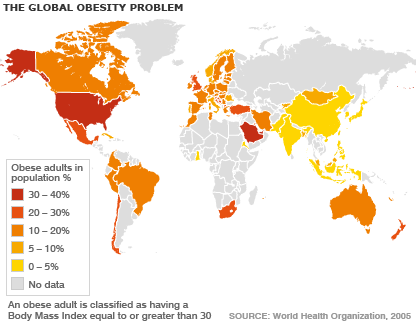

---
title       : Shiny BMI Calculator
subtitle    : Developing Data Products Course Project
author      : Sumeet Shah
job         : 
framework   : revealjs        # {io2012, html5slides, shower, dzslides, ...}
highlighter : highlight.js  # {highlight.js, prettify, highlight}
hitheme     : moon      # 
widgets     : []            # {mathjax, quiz, bootstrap}
mode        : selfcontained # {standalone, draft}
knit        : slidify::knit2slides

--- .class #id 

## Shiny BMI Calculator

### Developing Data Products Course Project

#### Sumeet Shah

--- .class #id 

## The Problem: Obesity

In recent years, the world has come to face increasing levels of obesity. This increase in unhealthy levels of weight is prevalent in wealthy nations like the United States of America and Australia, and is spreading to developing nations like India and China as well. Obesity affects men, women, and children, as it is often the result of lifestyle choices and personal habits (although there are cases where genetics and/or medical issues are the cause).



--- .class #id 

## Body Mass Index as a General Measure

An individual's Body Mass Index(BMI) is a value derived from an individual's height and weight.  The calculation is the body mass divided by the square of the height (kg/m^2).

The purpose of BMI is to categorize an individual as underweight(<18.5), healthy(18.5 to 24.9), overweight(25 to 30), or obese(>30) based on the value. While not a perfect measure of an individual's health/condition in relation to weight, it does provide individuals with guidelines as to how they should approach their weight. For example, an individual weighing 80 kg who is 180 cm tall will have a BMI of:

```r
80/(180/100)^2
```

```
## [1] 24.69136
```

This individual falls into the upper end of the "Healthy" weight category. They should make efforts to either maintain or lose weight, but avoid gaining any if possible.

--- .class #id 

## Shiny BMI Calculator

The Shiny BMI Calculator is an easy to use tool where an individual can find not only their current BMI by inputting their current height and weight, but also see how gaining/losing weight and height would affect their BMI.

For adults, their height is relatively fixed, so it is easy for them to pick a target weight and work towards it. The application suggests an "Ideal Weight" which would give the individual a BMI of 21.75, which is right in the middle of the "Healthy" weight range.  For children, their height and weight are constantly changing, but their BMI can be used to check if they are over/underweight so that their parents can help push their eating/exercise habits in the right direction.

--- .class #id 

## Conclusion

This application is very simple and easy to use.  The idea behind it is that individuals can check their current BMI and see how changes in their weight and height would impact their BMI, as well as what weight they should aim to be in order to obtain a BMI in the middle of the "Healthy" range. Try it out for yourself at https://sumeetsshah.shinyapps.io/ShinyBMI !

Have fun and stay healthy!

